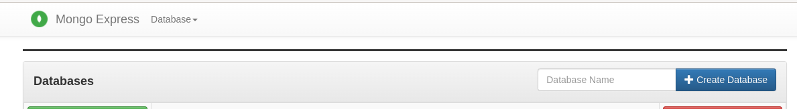
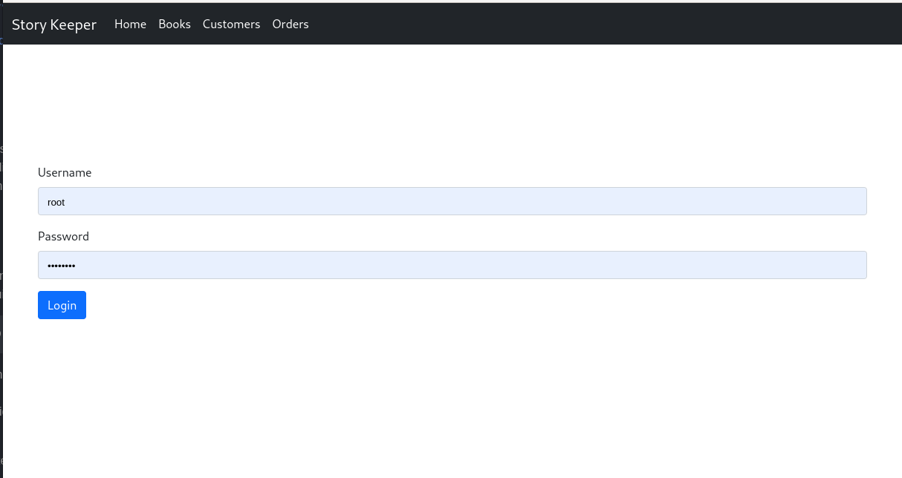

# Story Keeper

## Development Environment Setup
1. Spring Cli Required Download and install from:
   1. https://docs.spring.io/spring-boot/docs/current/reference/html/getting-started.html#getting-started.installing.cli
2. JDK 1.8 (Java 8) Required and needs to be set to default
   1. https://www.oracle.com/java/technologies/downloads/#java8
3. Maven is Required:
   1. https://maven.apache.org/download.cgi
## IDE Setup
1. Make sure IDE is using JDK 8.
   1. Check with IDE instructions on how to set the SDK version
2. Open the pom.xml file in the editor
3. Right-Click in the open pom.xml file in the editor and select Maven-> Reload Project. This will download the required Maven/Spring Dependencies

## The App and Database Uses Docker Container Technology

### The mongo database container needs to be setup before first
1. Comment out the storykeeper service priot to proceeding
    a. open the docker-compose.yml file from the project root directory in any text editor
    b. highlight the following portion of the file.
```
  storykeeper:
    build:
      context: .
      dockerfile: ./dockerfile
    image: storykeeper-app
    container_name: storykeeper-app
    depends_on:
      - mongodb
    ports:
      - "8080:8080"
```
   c. Press Ctrl+/ on the keyboard to comment out this section.
   d. The repository starts with the mongoexpress container already commented out, uncomment the following section for development and setup of the database
```
  #   mongo-express:
  #     container_name: mongo-express
  #     image: mongo-express
  #     ports:
  #       - '9001:8081'
  #     environment:
  #       - ME_CONFIG_MONGODB_SERVER=mongodb
  #       - ME_CONFIG_MONGODB_PORT=27017
  #       - ME_CONFIG_MONGODB_ADMINUSERNAME=storykeeperroot
  #       - ME_CONFIG_MONGODB_ADMINPASSWORD=storykeeperpassword
  #     depends_on:
  #       - mongodb
```
2. Save the file
4. Change directory to the root of the project directory in a terminal or cmd prompt in windows and run the following command
```
docker-compose up -d
```
5. Check Docker Status by running the following command in the termina/cmd prompt:
```aidl
docker ps
```
7. The following containers should be Up and listed as such:
```
CONTAINER ID   IMAGE           COMMAND                  CREATED       STATUS       PORTS                                           NAMES
1f29a80479c6   mongo-express   "tini -- /docker-ent…"   4 hours ago   Up 4 hours   0.0.0.0:9001->8081/tcp, :::9001->8081/tcp       mongo-express
6e376c4e70f9   mongo           "docker-entrypoint.s…"   3 days ago    Up 4 hours   0.0.0.0:27017->27017/tcp, :::27017->27017/tcp   mongodb
```
8. *** mongo-express may fail to start ***
9. Run the following
```
docker ps -a
```
10. From the output copy the CONTAINER ID for the mongo-express container and enter the following:
```
docker start <enter the CONTAINER ID here>
```
11. Recheck the status of running containers with
```
docker ps
```

## Database Setup
1. Navigate to the following url in the browser if you have mongo-express container running:
   1. localhost:9001
2. Type: 'storykeeperdb' into the Create Database Input for the Database name:

3. and Click the +Create Database Button.
4. You are now ready to RUN/DEBUG the Storykeeper Spring Application from any Java IDE, I prefer Intellij

## Run the project
*** IF YOU ARE RUNNING THE APP FROM THE IDE YOU MUST CHANGE A PROPERTY IN THE APPLICATION.PROPERTIES FILE IN THE RESOURCES DIRECTORY ******
*** CHANGE spring.data.mongodb.host=mongodb TO spring.data.mongodb.host=localhost ***

1. Start the application by executing debug/run on the StorykeeperDataApplication.java class
2. The Spring Cli should report building of the database collections and finally report:
```aidl
2022-03-25 00:02:53.835  INFO 28795 --- [  restartedMain] e.c.s.StorykeeperDataApplication         : Springboot and mongodb sequence id generator started successfully.
```
3. Navigate to thhe following url in the browser:
   1. localhost:8080
   2. The Story Keeper Application Login screen should be shown:


## Containerize the Storykeeper app for production environment
1. After developing and debugging perform the following steps
2. Uncomment storykeeper service in the docker-compose.yml file, recommend commenting out the mongo-express container service for security purposes
3. Change directory to the root of the project folder in the terminal/cmd prompt
4. Run the following command to teardown the initial docker containers:
```
docker-compose down
```
5. No container should be listed when checking running containers by entering the following cmd:
```
docker ps
```
6. Build the storykeeper container and start the application:
   a. In the root directory of the project run the following
   ```
   mvn clean
   ```
   b. Then the following:
   ```
   docker-compose up -d
   ```
7. ALL DONE! Now the app is running in a container along with the mongo database container.


## Data Models

### Book
```
{
    _id: ObjectId('622c207ae53798004086c68d'),  // Auto-generated by code
    title: 'Chief Data Liaison',
    author: 'Sam Breitenberg V',
    publisher: 'Mraz-Goyette',
    isbn: '5127336650369',
    category: 'FICTION',
    price_each: 25.00,
    quantity: 9
}
```

### Customer
```
{
    _id: ObjectId('622c207ae53798004086c698'),  // Auto-generated by code, _id NOT REQUIRED when adding new Book type is int
    first_name: 'Young',
    last_name: 'Kunde',
    email: 'herman.kovacek@email.com',
    phone: '4850431346',
    address: {
        addressLine1: '82711 Ethan Tunnel',
        city: 'New Dominique',
        state: 'South Carolina',
        postCode: '02481-9400'
    }
}
```
### Order
```
{
    customer_email: 'herman.kovacek@email.com',    // 
    items: [
        {
            _id: ObjectId('622c207ae53798004086c68d'),
            title: 'Chief Data Liaison',
            author: 'Sam Breitenberg V',
            publisher: 'Mraz-Goyette',
            isbn: '5127336650369',
            category: 'FICTION',
            price_each: 25,
            quantity: 9
        },
        {
            _id: ObjectId('622c207ae53798004086c68e'),
            title: 'Regional Branding Coordinator',
            author: 'Gale Bartell DVM',
            publisher: 'Fadel-Wilkinson',
            isbn: '8730101039281',
            category: 'FICTION',
            price_each: 77,
            quantity: 5
        },
        {
            _id: ObjectId('622c207ae53798004086c68f'),
            title: 'District Data Producer',
            author: 'Mrs. Lorenza Langosh',
            publisher: 'Stiedemann, Gusikowski and Wiegand',
            isbn: '2340983521790',
            category: 'FICTION',
            price_each: 22,
            quantity: 7
        },
    ],
    subTotal: 2,
    taxAmount: 0.99,
    grandTotal: 2.99,
}
```

# APIs
## Books
#### GET methods
URL IP:9500/api/books    : List ALL books IN books collection<br>
URL IP:9500/api/books/title?{title} : Search for a book in the inventory with a title like "java"<br>
URL IP:9500/api/books/author?{author}  : Search for books in the inventory by an author like "kathy"<br>
URL IP:9500/api/books/isbn?{isbn} : Search for book in the inventory by the ISBN like "97-34574326432" 13 digits.<br>
#### POST methods
URL IP:9500/api/add-book : Add a book to the inventory by providing JSON for book model<br>
#### PUT methods
URL IP:9500/api/update-book : Update the book by providing the JSON for the book model<br>
#### DELETE methods
URL IP:9500/api/delete-book?{isbn} : Delete a book by providing the ISBN string for the book<br>


## Customers
#### GET methods
URL IP:9500/api/customers  : List ALL Customers IN customers collection<br>
URL IP:9500/api/customers/lastname?{lastname} : Search for a customer by last name<br>
URL IP:9500/api/customers/email?{email} : Search for a customer by email<br>
URL IP:9500/api/customers/phone?{phone} : Search for a customer by phone number<br>
#### POST methods
URL IP:9500/api/add-customer : Add a Customer to the database by providing the JSON for customer model<br>
#### PUT methods
URL IP:9500/api/update-customer : Update the customer by providing the JSON for the customer model<br>
#### DELETE methods
URL IP:9500/api/delete-customer?{email} : Delete a customer by providing the email for the customer<br>

## Orders
#### GET methods
URL IP:9500/api/orders  : List All Orders in the order's collection<br>
URL IP:9500/api/orders/email?{email}  : Search for an order by order email of customer<br>
#### POST methods
URL:9500/api/add-order  : Add an Order to the database by providing the JSON for the order model<br>
#### PUT methods
URL:9500/api/update-order  : Update the order by providing the JSON for the order model<br>
#### DELETE methods
URL:9500/api/delete-order?{email}  : Delete an order by providing the email for the order of customer<br>

# Docker Container Shutdown
1. Navigate to the root directory of the storykeeperdata project and run the following:
```aidl
docker-compose down
```
## Remove Persistant Docker Volumes
1. Run the Docker command to list the Docker volumes:
```aidl
docker volume ls
```
2. Run the following command to remove each volume:
```aidl
docker volume rm <paste the id of the volume here>
```

## Remove Old Docker Containers
1. Run the following to list the docker containers including inactive:
```aidl
docker ps -a
```
2. Run the following command to remove an old container if any exist:
```aidl
docker rm <paste docker ID here>
```

## The Project is in work 
  
